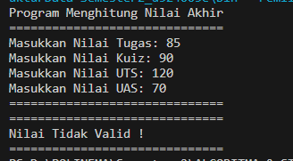
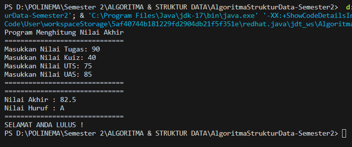
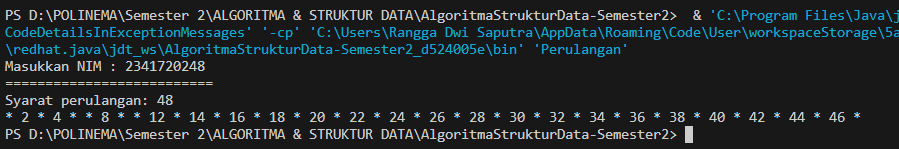
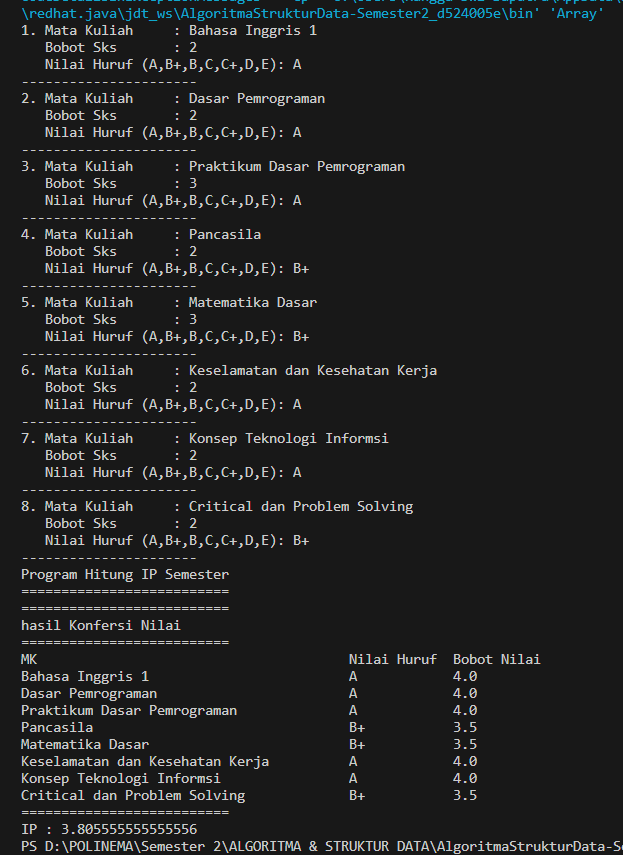
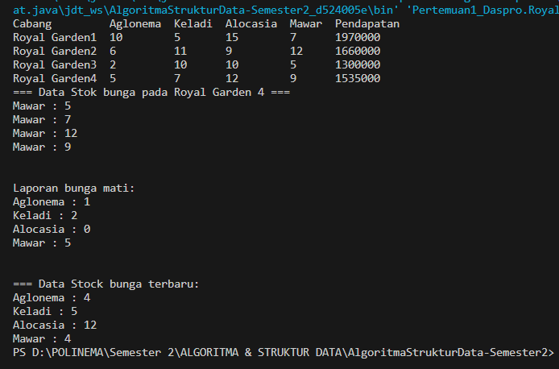
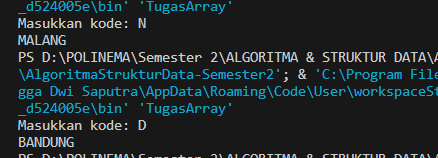
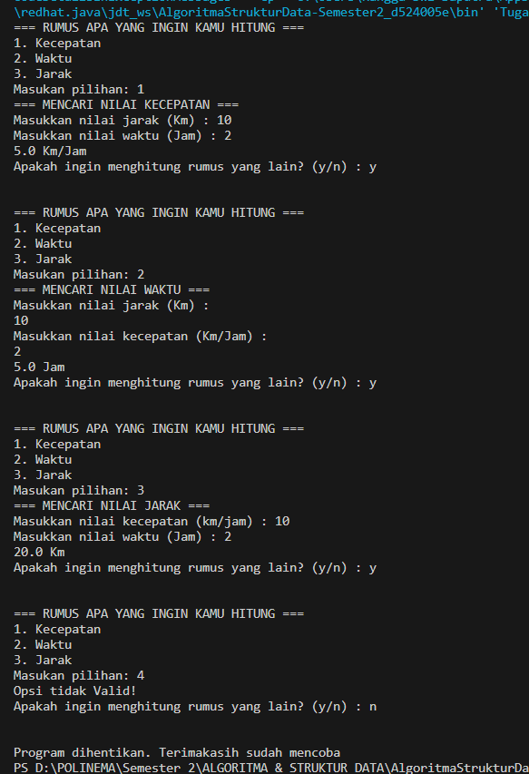

# LAPORAN PRAKTIKUM II
# ALGORITMA & STRUKTUR DATA (OBJECT)
Nama  : Rangga Dwi Saputra <br>
NIM   : 2341720248 <br>
Kelas : TI - 1B <br>
## 1. Praktikum Pemilihan
```java
import java.util.Scanner;
public class Pemilihan {
    public static void main(String[] args) {
        
        Scanner input = new Scanner (System.in);
        
        float tugas, kuiz, uts, uas ;
        double nilaiAkhir;
    
        System.out.println("Program Menghitung Nilai Akhir");

        System.out.println("==============================");
        System.out.print("Masukkan Nilai Tugas: ");
        tugas = input.nextFloat();
        System.out.print("Masukkan Nilai Kuiz: ");
        kuiz = input.nextFloat();
        System.out.print("Masukkan Nilai UTS: ");
        uts = input.nextFloat();
        System.out.print("Masukkan Nilai UAS: ");
        uas = input.nextFloat();
        System.out.println("==============================");
        System.out.println("==============================");

        if (tugas >= 0 && tugas <= 100 && kuiz >= 0 && kuiz <= 100 &&
        uas >= 0 && uts <= 100 && uas >= 0 && uas <= 100) {
            
            nilaiAkhir = ( (tugas * 0.2) + (kuiz * 0.2) + (uts * 0.3) + (uas * 0.4)) ;
            String message = 80 < nilaiAkhir && nilaiAkhir <= 100 ? "A"
                : 73 < nilaiAkhir && nilaiAkhir <= 80 ? "B+"
                : 65 < nilaiAkhir && nilaiAkhir <= 73 ? "B"
                : 60 < nilaiAkhir && nilaiAkhir <= 65 ? "C+"
                : 50 < nilaiAkhir && nilaiAkhir <= 60 ? "C"
                : 39 < nilaiAkhir && nilaiAkhir <= 50 ? "D"
                : "E";
            
                System.out.println("Nilai Akhir : " +nilaiAkhir);
                System.out.println("Nilai Huruf : " +message);
                System.out.println("==============================");
                
                if (nilaiAkhir <= 50) {
                    System.out.println("ANDA TIDAK LULUS !");
                } else {
                    System.out.println("SELAMAT ANDA LULUS !");
                }
        } else { 
            System.out.println("Nilai Tidak Valid ! ");
            System.out.println("==============================");
            
        }
    }
}
```
Hasil compile:<br>


##  2. Praktikum Perulangan
```java
import java.util.Scanner;
public class Perulangan {
    public static void main(String[] args) {
        
        Scanner sc = new Scanner(System.in);
        String nim;

        System.out.print("Masukkan NIM : ");
        nim = sc.nextLine();
        System.out.println("==========================");

            String duaDigitString = nim.substring(nim.length() - 2);
            int n = Integer.parseInt(duaDigitString);
        
        if (n<10) {
            n +=10;
        System.out.println("Syarat perulangan: " +n);
        for (int i = 1; i < n; i++) {
            if (i==6 || i==10) {
                continue;
            } else if ( i % 2 == 0){
                System.out.print(i + " ");
            } else {
                System.out.print("* ");
            }
        } 
        } else {
        System.out.println("Syarat perulangan: " +n);
        for (int i = 1; i < n; i++) {
            if (i==6 || i==10) {
                continue;
            } else if ( i % 2 == 0){
                System.out.print(i + " ");
            } else {
                System.out.print("* ");
            }
        }
     }
    }
}
```
Hasil Compile: <br>

## 3. Praktikum Array
```
import java.util.Scanner;
public class Array {

    public static String format(int lebar, String s) {
        return String.format("%-" + lebar + "s", s);
    }

    public static void main(String[] args) {
        
        Scanner sc = new Scanner(System.in);
        String [] matkul = new String [8];
        String [] huruf = new String [8];
        double [] bobotSks = new double [8];
        double [] nilai = new double [8];
        int jumlahSks = 0;
        double ip = 0;


        for (int i=0; i < matkul.length; i++) {
            System.out.print(i+1 + ". Mata Kuliah     : ");
            matkul [i] = sc.nextLine();
            System.out.print("   Bobot Sks       : ");
            bobotSks [i] = sc.nextDouble();
            System.out.print("   Nilai Huruf (A,B+,B,C,C+,D,E): ");
            huruf [i] = sc.next();
            sc.nextLine();
            System.out.println("----------------------");
            
            jumlahSks += bobotSks[i];
        }

        System.out.println("Program Hitung IP Semester");
        System.out.println("==========================");

        for (int i=0; i<matkul.length; i++) {   
        
            nilai [i] = huruf [i].equalsIgnoreCase("A")  ? 4.0
                : huruf [i].equalsIgnoreCase("B+")  ? 3.5
                : huruf [i].equalsIgnoreCase("B")  ? 3.0
                : huruf [i].equalsIgnoreCase("C+")  ? 2.5
                : huruf [i].equalsIgnoreCase("C")  ? 2.0
                : huruf [i].equalsIgnoreCase("D")  ? 1.0
                : 0.0;
        }

           System.out.println("==========================");
           System.out.println("hasil Konfersi Nilai");
           System.out.println("==========================");

            System.out.println(String.format("%-40s %-12s %-12s",
            "MK",
            "Nilai Huruf",
            "Bobot Nilai"
        ));
            for (int i=0; i<matkul.length; i++) {
                System.out.println(String.format("%-40s %-12s %-12s",
                matkul[i],
                huruf[i],
                nilai[i]
                ));
           }

           for (int i=0; i<matkul.length; i++) {
            ip += (nilai[i] * bobotSks[i] )/ jumlahSks;
           }
           
        
        System.out.println("==========================");
        System.out.println("IP : " +ip); 

     }
}
```
Hasil Compile: <br>

5
## 4. Praktikum Fungsi
```
package Pertemuan1_Daspro;

public class RoyalGarden {

    static int [] jml_bunga [] = new int [][] {
        {10,5, 15,7}, 
        {6, 11, 9, 12}, 
        {2, 10, 10, 5}, 
        {5, 7, 12, 9}
        };

    static String [] bunga = {"Aglonema", "Keladi", "Alocasia", "Mawar"};

    public static void main(String[] args) {
        displayPendapatan();
        RoyalGarden4(); 
    }

    static void displayPendapatan() {
        System.out.printf("%-14s %-9s %-7s %-9s %-6s %-10s \n", "Cabang", "Aglonema", "Keladi", "Alocasia", "Mawar",
                "Pendapatan");

        for (int i=0;i < jml_bunga.length; i++) {
            int pendapatan = 0;
            pendapatan += jml_bunga[i][0] * 75000;
            pendapatan += jml_bunga[i][1] * 50000;
            pendapatan += jml_bunga[i][2] * 60000;
            pendapatan += jml_bunga[i][3] * 10000;

            System.out.printf("%-14s %-9s %-7s %-9s %-6s %-10s \n", "Royal Garden" +(i+1),  jml_bunga[i][0], jml_bunga[i][1], jml_bunga[i][2], jml_bunga[i][3],
                pendapatan);
        }
    }
    
   static void RoyalGarden4() {
        System.out.println("=== Data Stok bunga pada Royal Garden 4 === ");
        for (int i = 0; i<bunga.length; i++) {
            System.out.println(bunga[3] +" : "+ jml_bunga[3][i]);
        }
        System.out.println("\n");
        System.out.println("Laporan bunga mati:");
        
            System.out.println(bunga[0] +" : "+ 1);
            System.out.println(bunga[1] +" : "+ 2);
            System.out.println(bunga[2] +" : "+ 0);
            System.out.println(bunga[3] +" : "+ 5);
            System.out.println("\n");
            System.out.println("=== Data Stock bunga terbaru: ");

            System.out.println(bunga[0] +" : "+ (jml_bunga[3][0]-1));
            System.out.println(bunga[1] +" : "+ (jml_bunga[3][1]-2));
            System.out.println(bunga[2] +" : "+ (jml_bunga[3][2]));
            System.out.println(bunga[3] +" : "+ (jml_bunga[3][3]-5));
    }
}

```
Hasil compile:<br>

## Tugas Implementasi Array
```
import java.util.Scanner;
public class TugasArray {
    public static void main(String[] args) {
        
        char kode [] = {'A', 'B', 'D', 'E', 'F', 'G', 'H', 'L', 'N', 'T' };
        char kota [][] = {
            {'B', 'A', 'N', 'T', 'E', 'N'},
            {'J', 'A', 'K', 'A', 'R', 'T', 'A'},
            {'B', 'A', 'N', 'D', 'U', 'N', 'G'},
            {'C', 'I', 'R', 'E', 'B', 'O', 'N'},
            {'B', 'O', 'G', 'O', 'R'},
            {'P', 'E', 'K', 'A', 'L', 'O', 'N', 'G', 'A', 'N'},
            {'S','E', 'M', 'A', 'R', 'A', 'N', 'G'},
            {'S', 'U', 'R', 'A', 'B', 'A', 'Y', 'A'},
            {'M', 'A', 'L', 'A', 'N', 'G'},
            {'T', 'E', 'G', 'A', 'L'}
        };
       
        Scanner input = new Scanner (System.in);
        System.out.print("Masukkan kode: ");
        char key = input.next().charAt(0);
        int nomor = 0;

        for (int i=0; i < kode.length; i++){
            if (kode[i] == key) {
                nomor = i;
                // System.out.println(nomor);
            }
        }

        for (int i=0; i<kota[nomor].length;i++){
            System.out.print(kota[nomor][i]);
        }
    }
}

```
Hasil compile: <br>

## Tugas Implementasi Fungsi
```
import java.util.Scanner;
public class TugasFungsi {

    static Scanner input = new Scanner(System.in);
    
    public static void main(String[] args) {
        String lanjut;
        do {
        System.out.println("=== RUMUS APA YANG INGIN KAMU HITUNG ===");
        System.out.println("1. Kecepatan");
        System.out.println("2. Waktu");
        System.out.println("3. Jarak");
        System.out.print("Masukan pilihan: ");
        int opsi = input.nextInt();

        switch (opsi) {
            case 1:
                System.out.println(kecepatan() + " Km/Jam");
                break;

            case 2:
                System.out.println(waktu() + " Jam");
                break;

            case 3:
            System.out.println(jarak() + " Km");
                break;

            default:
                System.out.println("Opsi tidak Valid!");
                break;
        }

        System.out.print("Apakah ingin menghitung rumus yang lain? (y/n) : ");
        lanjut =input.next();
        System.out.println("\n");
    } while (lanjut.equalsIgnoreCase("y"));
    System.out.println("Program dihentikan. Terimakasih sudah mencoba"); 
    }

    public static double kecepatan (){
        double kecepatan;
        System.out.println("=== MENCARI NILAI KECEPATAN ===");
        System.out.print("Masukkan nilai jarak (Km) : ");
        double s= input.nextDouble();
        System.out.print("Masukkan nilai waktu (Jam) : ");
        double t = input.nextDouble();
        
        kecepatan = s / t;
        return kecepatan;
    }

    public static double waktu () {
        double waktu;
        System.out.println("=== MENCARI NILAI WAKTU ===");
        System.out.println("Masukkan nilai jarak (Km) : ");
        double s = input.nextDouble();
        System.out.println("Masukkan nilai kecepatan (Km/Jam) : ");
        double v = input.nextDouble();

        waktu = s / v;
        return waktu;
    }

    public static double jarak () {
        double jarak;
        System.out.println("=== MENCARI NILAI JARAK ===");
        System.out.print("Masukkan nilai kecepatan (km/jam) : ");
        double v = input.nextDouble();
        System.out.print("Masukkan nilai waktu (Jam) : ");
        double t = input.nextDouble();

        jarak = v * t;
        return jarak;
    }
}
```
Hasil compile: <br>
