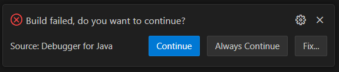
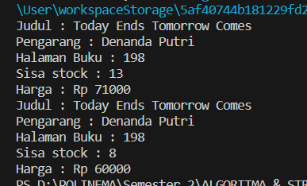
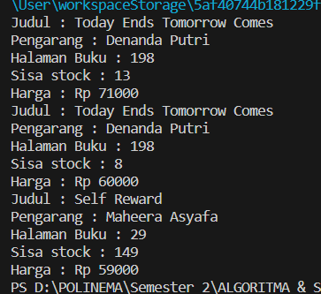

# LAPORAN PRAKTIKUM II
# ALGORITMA & STRUKTUR DATA (OBJECT)
Nama  : Rangga Dwi Saputra <br>
NIM   : 2341720248 <br>
Kelas : TI - 1B <br>
## 2. Praktikum
### 2.1 Percobaan 1: Deklarasi Class, Atribut dan Method
Code :
```
package Pertemuan2_Object;

public class Buku23 {
    
    String judul, pengarang;
    int halaman, stock, harga;
    
    void tampilInformasi() {
        System.out.println("Judul : " +judul);
        System.out.println("Pengarang : " +pengarang);
        System.out.println("Halaman Buku : " +halaman);
        System.out.println("Sisa stock : " +stock);
        System.out.println("Harga : Rp " +harga);
    }
    void terjual(int jml) {
        stock -= jml;
    }
    void restock(int jml) {
        stock += jml;
    }
    void gantiHarga(int hrg ) {
        harga = hrg;
    }
}
```
#### 2.1.1 Verifikasi Hasil Percobaan
Dari compline code tersebut akan eror<br>

#### 2.1.2 Pertanyaan
1. Sebutkan dua karakteristik class atau object!<br>
2. Perhatikan class Buku pada Praktikum 1 tersebut, ada berapa atribut yang dimiliki oleh class
Buku? Sebutkan apa saja atributnya!<br>
3. Ada berapa method yang dimiliki oleh class tersebut? Sebutkan apa saja methodnya!<br>
4. Perhatikan method terjual() yang terdapat di dalam class Buku. Modifikasi isi method tersebut
sehingga proses pengurangan hanya dapat dilakukan jika stok masih ada (lebih besar dari 0)!<br>
5. Menurut Anda, mengapa method restock() mempunyai satu parameter berupa bilangan int?<br>
#### 2.1.3 Jawab
1. + Berikut karakteristik dari Class<br>
 Abstraksi: dapat merepresentasikan objek nyata dalam bentuk yang lebih terdefinisi dan struktural. Class memberikan kerangka kerja untuk mendefinisikan atribut dan perilaku objek<br>
 Inheritance: dapat mewarisi sifat dan perilaku dari Class lain, yang memungkinkan untuk penggunaan kembali kode dan pembangunan hirarki Class yang terstruktur<br>
+ Berikut karakteristik dari Object<br>
 Instansiasi: Setiap objek memiliki keadaan sendiri dan dapat melakukan tindakan yang terkait dengan kelasnya<br>
 Enkapsulasi: data (atribut) dan metode (perilaku) yang berhubungan dengan objek tertentu terkandung dalam objek itu sendiri<br>
2. ada 5 atribut, yaitu String judul, pengarang dan int halaman, stock, harga<br>
3. ada 4 methode, yaitu void tampilInformasi(), void terjual(int jml), void restock(int jml), dan void gantiHarga(int hrg)
4. Berikut hasil modifikasinya<br>
```
 void terjual(int jml) {
        if (stock > 0) {
        stock -= jml;
        } else { System.out.println("Stock sudah habis");}
    }
```
5. Agar nilai dari variable bertipe int tersebut dapat langsung digunakan dalam methode yang telah dibuat ketika nilainya diganti<br>

### 2.2 Percobaan 2: Instansiasi Object, serta Mengakses Atribut dan Method
Code: 
```
package Pertemuan2_Object;
public class BukuMain {
    public static void main(String[] args) {
        Buku23 bk1  = new Buku23 ();   
        bk1.judul = "Today Ends Tomorrow Comes";
        bk1.pengarang = "Denanda Putri";
        bk1.halaman = 198;
        bk1.stock = 13;
        bk1.harga = 71000;

        bk1.tampilInformasi();
        bk1.terjual(5);
        bk1.gantiHarga(60000);
        bk1.tampilInformasi();  
    }
}
```
#### 2.2.1 Verifikasi Hasil Percobaan

#### 2.2.2 Pertanyaan 
1. Pada class BukuMain, tunjukkan baris kode program yang digunakan untuk proses instansiasi!
Apa nama object yang dihasilkan?<br>
2. Bagaimana cara mengakses atribut dan method dari suatu objek?<br>
3. Mengapa hasil output pemanggilan method tampilInformasi() pertama dan kedua berbeda?<br>
#### 2.2.3 Jawab
1. instansiasi ditunjukkan dengan kode berikut<br>
```
Buku23 bk1  = new Buku23 ();
```
dan objek yang dihasilkan adalah bk1<br>
2. Dengan menuliskan nama variablenya setelah nama objek dituliskan contoh bk1.judul<br>
untuk mengakses methode, nama methode dituliskan setelah nama objek, contoh bk1.tampilInformasi()<br>
3. Karena dilakukan perubahan pada metdhode bk1.gantiHarga(int hrg)<br>

### 2.3 Percobaan 3: Membuat Konstruktor
Code modifikasi pada Buku23.java :
```
 public Buku23(){}
    

    public Buku23 (String jdl, String pg, int stock, int hal, int hrg) {
        judul = jdl;
        pengarang = pg;
        this.stock = stock;
        halaman = hal;
        harga = hrg;
    }
```
Code modifikasi pada BukuMain23.java :
```
Buku23 bk2 = new Buku23("Self Reward", "Maheera Asyafa", 160, 29, 59000);
        bk2.terjual(11);
        bk2.tampilInformasi();
```
#### 2.3.1 Verifikasi Hasil Program

#### 2.3.2 Pertanyaan
1. Pada class Buku di Percobaan 3, tunjukkan baris kode program yang digunakan untuk
mendeklarasikan konstruktor berparameter! <br>
2. Perhatikan class BukuMain23. Apa sebenarnya yang dilakukan pada baris program <br>
```
Buku23 bk2 = new Buku23("Self Reward", "Maheera Asyafa", 160, 29, 59000); 
```
3. Hapus konstruktor default pada class Buku, kemudian compile dan run program. Bagaimana
hasilnya? Jelaskan mengapa hasilnya demikian!
4. Setelah melakukan instansiasi object, apakah method di dalam class Buku harus diakses
secara berurutan? Jelaskan alasannya!
5. Buat object baru dengan nama buku<NamaMahasiswa> menggunakan konstruktor
berparameter dari class Buku!
#### 2.3.3 Jawaban
1. deklarasi sekaligus instansiasi konstrukstor berparamater ditunjukkan pada kode program berikut
```
Buku23 bk2 = new Buku23("Self Reward", "Maheera Asyafa", 160, 29, 59000);
```
2. inisialisasi objek baru dengan parameter yang mengganti nilai yang ada pada objek bk1
3. Ketika membuat sebuah objek dari Class BukuMain23(), Java akan mencoba untuk memanggil konstruktor default jika tidak ada konstruktor lain yang cocok. Jika sudah menulis konstruktor khusus dengan parameter, Java tidak akan lagi menyediakan konstruktor default secara otomatis. Oleh karena itu, jika menghapus konstruktor default, maka tidak ada konstruktor yang tersedia untuk dipanggil saat membuat objek, dan itu akan menyebabkan kesalahan kompilasi <br>
4. Ya, karena pada methode tampilInformasi() objectnya sudah disusun secara berurutan juga<br>
5. Berikut object baru yang telah saya buat
```
 Buku23 Putra = new Buku23("Ayo Berjuang", "Rangga Dwi Saputra", 20, 201, 50000);
        Putra.tampilInformasi();
```