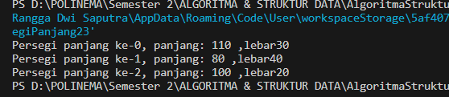
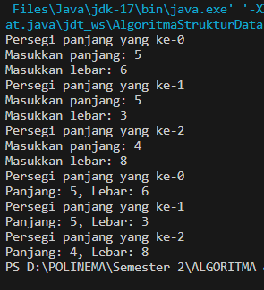
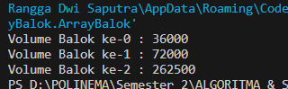

# LAPORAN PRAKTIKUM III
# ARRAY OF OVJECT
Nama  : Rangga Dwi Saputra <br>
NIM   : 2341720248 <br>
Kelas : TI - 1B <br>
## Percobaan 1: Membuat Array dari Object, Mengisi dan Menampilkan
### 3.1.1 Code
```java
package Pertemuan3_ArrayOfObject;

public class PersegiPanjang23 {
    public int panjang;
    public int lebar;


    public static void main(String[] args) {
        PersegiPanjang23 [] ppArray = new PersegiPanjang23[3];

        ppArray [0] = new PersegiPanjang23();
        ppArray [0].panjang = 110 ;
        ppArray [0].lebar  = 30;

        ppArray [1] = new PersegiPanjang23();
        ppArray [1].panjang = 80 ;
        ppArray [1].lebar  = 40;

        ppArray [2] = new PersegiPanjang23();
        ppArray [2].panjang = 100 ;
        ppArray [2].lebar  = 20;

        System.out.println("Persegi panjang ke-0, panjang: " +ppArray[0].panjang+ " ,lebar" + ppArray[0].lebar);
        System.out.println("Persegi panjang ke-1, panjang: " +ppArray[1].panjang+ " ,lebar" + ppArray[1].lebar);
        System.out.println("Persegi panjang ke-2, panjang: " +ppArray[2].panjang+ " ,lebar" + ppArray[2].lebar);
    }
}

```
### 3.1.2 Hasil Compile

### 3.1.3 Pertanyaan
1. Apakah class yang akan dibuat array of object harus selalu memiliki atribut dan sekaligus method?Jelaskan!
2. Apakah class PersegiPanjang23 memiliki konstruktor?Jika tidak, kenapa dilakukan pemanggilan konstruktor pada baris program berikut:
    ```java
    ppArray [1] = new PersegiPanjang23();
    ```
3. Apa yang dimaksud dengan kode berikut:
    ```java
    PersegiPanjang23 [] ppArray = new PersegiPanjang23[3];
    ```
4. Apa yang dimaksud dengan kode berikut:
    ```java
    ppArray [1] = new PersegiPanjang23();
    ppArray [1].panjang = 80 ;
    ppArray [1].lebar  = 40;
    ```
5. Mengapa class main dan juga class PersegiPanjang dipisahkan pada uji coba 3.2?
### 3.1.4 Jawaban
1.  Class pada array of object tidak harus selalu memilki atribut dan sekaligus methode, karena kelas digunakan sebagai cetakan untuk membuat objek. Ketika membuat array dari objek-objek tersebut, itu berarti membuat banyak instance dari kelas yang sama
2.  Tidak terdapat deklarasi konstruktor secara eksplisit. Namun masih memiliki konstruktor default/bawaan yang dipanggil secara otomatis saat object yang disimpan dalam `ppArray` pada class `PersegiPanjang23` dibuat menggunakan operator `new`
3.  Deklarasi array object yang disimpan dalam `ppArray` sekaligus inisialisasi array yang dapat menyimpan 3 object 
4.  Dalam ppArray dibuat konstruktor default untuk kemudian diisi nilai objectnya
5.  Program yang saya buat tidak dipisah, namun jika dipisah pun juga tidak papa. Hanya saja pemisahan class dapat memakan ruang dan menjadikan banyak class class ynag diakses satu sama lain
## Percobaan 2: Menerima Input Isian Array Menggunakan Looping
### 3.2.1 Code: 
```java
public class PersegiPanjang23 {
    public int panjang;
    public int lebar;

    public static void main(String[] args) {
        PersegiPanjang23 [] ppArray = new PersegiPanjang23[3];
        Scanner sc = new Scanner (System.in);

        for (int i=0; i<ppArray.length;i++){
            ppArray[i] = new PersegiPanjang23();
            System.out.println("Persegi panjang yang ke-"+i);
            System.out.print("Masukkan panjang: ");
            ppArray[i].panjang = sc.nextInt();
            System.out.print("Masukkan lebar: ");
            ppArray[i].lebar = sc.nextInt();
        }

        for (int i=0;i<ppArray.length;i++){
            System.out.println("Persegi panjang yang ke-"+i);
            System.out.println("Panjang: "+ppArray[i].panjang + ", Lebar: " +ppArray[i].lebar);
        }
    }
}    
```
### 3.2.2 Hasil Compile

### 3.2.3 Pertanyaan
1. Apakah array of object dapat diimplementasikan pada array 2 Dimensi?
2. Jika jawaban soal no satu iya, berikan contohnya! Jika tidak, jelaskan!
3. Jika diketahui terdapat class Persegi yang memiliki atribut sisi bertipe integer, maka kode dibawah ini akan memunculkan error saat dijalankan. Mengapa?
```java
Persegi[] pgArray = new Persegi[100];
pgArray[5].sisi = 20;
```
4. Modifikasi kode program pada praktikum 3.3 agar length array menjadi inputan dengan Scanner!
5. Apakah boleh Jika terjadi duplikasi instansiasi array of objek, misalkan saja instansiasi dilakukan pada ppArray[i] sekaligus ppArray[0]?Jelaskan !
### 3.2.4 Jawaban
1. Bisa, yang mana memungkinkan untuk membuat matriks (array dua dimensi) di mana setiap elemen adalah objek dari suatu kelas tertentu
2. `arrayPersegi` yang menyimpan objek dari class `PersegiPanjang`. Kemudian di inisialisasi setiap elemen dengan objek `PersegiPanjang` menggunakan konstruktor kelas tersebut 
```java
    PersegiPanjang[][] arrayPersegi = new PersegiPanjang[2][3];
        arrayPersegi[0][0] = new PersegiPanjang(10, 20);
        arrayPersegi[0][1] = new PersegiPanjang(15, 25);
        arrayPersegi[0][2] = new PersegiPanjang(18, 30);
        arrayPersegi[1][0] = new PersegiPanjang(12, 22);
        arrayPersegi[1][1] = new PersegiPanjang(20, 35);
        arrayPersegi[1][2] = new PersegiPanjang(24, 40);
```
3. Karena pada saat inisialisasi array `pgArray`, array tersebut hanya dibuat tetapi tidak ada objek `Persegi` yang diinisialisasi di dalamnya.
4. ```java
    int x;
            
            Scanner sc = new Scanner (System.in);
            System.out.print("Kapasitas Array: ");
            x = sc.nextInt();

            PersegiPanjang23 [] ppArray = new PersegiPanjang23[x];
   ```
5. Tidak bisa terjadi duplikasi instnsiasi objek pada elemen array yang sama. Inisialisasi `new` yang mana menciptakan objek baru, kedua instansi (ppArray[i] dan ppArray[0]) tetap merujuk ke objek yang sama di memori. Karena tidak bisa objek yang berbeda tersimpan dalam memori yang sama
## Percobaan 3: Penambahan Operasi Matematika di Dalam Method
### 3.3.1 Code:
```java
package Pertemuan3_ArrayOfObject.ArrayBalok;

public class Balok {
    public int panjang;
    public int lebar;
    public int tinggi;

    public Balok(int p, int l, int t){
        panjang = p;
        lebar = l;
        tinggi = t;
    }

    public int HitungVolume(){
        return panjang * lebar * tinggi;
    }
}
```
Di jalankan pada class main 
```java
package Pertemuan3_ArrayOfObject.ArrayBalok;

public class ArrayBalok {
    public static void main(String[] args) {
        Balok [] blArray = new Balok [3];
        blArray [0] = new Balok(100, 30, 12);
        blArray [1] = new Balok(120, 40, 15);
        blArray [2] = new Balok(210, 50, 25);

        for (int i=0; i<blArray.length; i++) {
            System.out.println("Volume Balok ke-"+i+ " : " + blArray[i].HitungVolume() );
        }
    }
}
```
### 3.3.2 Hasil Compile:

### 3.3.3 Pertanyaan
1. Dapatkah konstruktor berjumlah lebih dalam satu kelas? Jelaskan dengan contoh!
2. Jika diketahui terdapat class Segitiga seperti berikut ini:
    ```
    public class Segitiga(){
        public int alas;
        public int tinggi;
    }
    ```
    Tambahkan konstruktor pada class Segitiga tersebut yang berisi parameter int a, int t
    yang masing-masing digunakan untuk mengisikan atribut alas dan tinggi
3. Tambahkan method hitungLuas() dan hitungKeliling() pada class Segitiga tersebut. Asumsi segitiga adalah segitiga siku-siku. (Hint: Anda dapat menggunakan bantuan library Math pada Java untuk mengkalkulasi sisi miring
4. Pada fungsi main, buat array Segitiga sgArray yang berisi 4 elemen, isikan masing-masing atributnya sebagai berikut:
    sgArray ke-0 alas: 10, tinggi: 4 <br>
    sgArray ke-1 alas: 20, tinggi: 10 <br>
    sgArray ke-2 alas: 15, tinggi: 6 <br>
    sgArray ke-3 alas: 25, tinggi: 10 <br>
5. Kemudian menggunakan looping, cetak luas dan keliling dengan cara memanggil method hitungLuas() dan hitungKeliling().

### 3.3.4 Jawaban
1. Dalan sebuah kelas dapat didefinisikan lebih dari satu konstruktor yang memiliki nama sama namun dengan parameter yang berbeda-beda. Saat objek baru dibuat dari kelas tersebut, Java akan memilih konstruktor yang sesuai berdasarkan parameter yang dilewatkan saat membuat objek. Contoh:
```java
public class Person {
    String name;
    int age;
    // Konstruktor tanpa parameter 
    public Person() {
        name = "Unknown";
        age = 0;
    }
    // Konstruktor dengan parameter nama
    public Person(String newName) {
        name = newName;
        age = 0;
    }
    // Konstruktor dengan parameter nama dan usia
    public Person(String newName, int newAge) {
        name = newName;
        age = newAge;
    }
}
```
