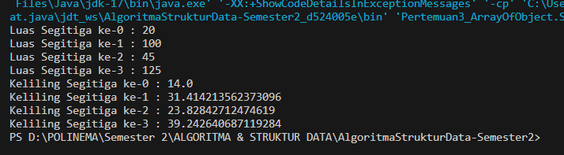
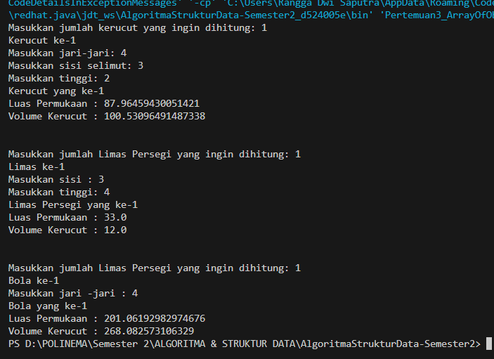
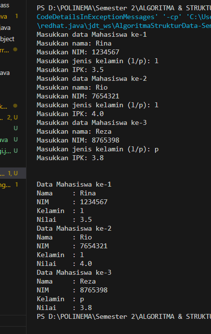
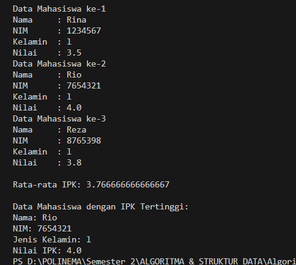

# LAPORAN PRAKTIKUM III
# ARRAY OF OBJECT
Nama  : Rangga Dwi Saputra <br>
NIM   : 2341720248 <br>
Kelas : TI - 1B <br>
## Percobaan 1: Membuat Array dari Object, Mengisi dan Menampilkan
### 3.1.1 Code
```java
package Pertemuan3_ArrayOfObject;

public class PersegiPanjang23 {
    public int panjang;
    public int lebar;


    public static void main(String[] args) {
        PersegiPanjang23 [] ppArray = new PersegiPanjang23[3];

        ppArray [0] = new PersegiPanjang23();
        ppArray [0].panjang = 110 ;
        ppArray [0].lebar  = 30;

        ppArray [1] = new PersegiPanjang23();
        ppArray [1].panjang = 80 ;
        ppArray [1].lebar  = 40;

        ppArray [2] = new PersegiPanjang23();
        ppArray [2].panjang = 100 ;
        ppArray [2].lebar  = 20;

        System.out.println("Persegi panjang ke-0, panjang: " +ppArray[0].panjang+ " ,lebar" + ppArray[0].lebar);
        System.out.println("Persegi panjang ke-1, panjang: " +ppArray[1].panjang+ " ,lebar" + ppArray[1].lebar);
        System.out.println("Persegi panjang ke-2, panjang: " +ppArray[2].panjang+ " ,lebar" + ppArray[2].lebar);
    }
}

```
### 3.1.2 Hasil Compile

### 3.1.3 Pertanyaan
1. Apakah class yang akan dibuat array of object harus selalu memiliki atribut dan sekaligus method?Jelaskan!
2. Apakah class PersegiPanjang23 memiliki konstruktor?Jika tidak, kenapa dilakukan pemanggilan konstruktor pada baris program berikut:
    ```java
    ppArray [1] = new PersegiPanjang23();
    ```
3. Apa yang dimaksud dengan kode berikut:
    ```java
    PersegiPanjang23 [] ppArray = new PersegiPanjang23[3];
    ```
4. Apa yang dimaksud dengan kode berikut:
    ```java
    ppArray [1] = new PersegiPanjang23();
    ppArray [1].panjang = 80 ;
    ppArray [1].lebar  = 40;
    ```
5. Mengapa class main dan juga class PersegiPanjang dipisahkan pada uji coba 3.2?
### 3.1.4 Jawaban
1.  Class pada array of object tidak harus selalu memilki atribut dan sekaligus methode, karena class digunakan sebagai cetakan untuk membuat objek. Ketika membuat array dari objek-objek tersebut, itu berarti membuat banyak instance dari class yang sama. Jika class yang akan dibuat array of object tidak menyertakan atribut dan methode itu merupakan pemborosan ruann. Namun, kembali lagi bahwa ada atau tidaknya tergantung fungsionalitas dan kebutuhannya
2.  Tidak terdapat deklarasi konstruktor secara eksplisit. Namun masih memiliki konstruktor default/bawaan yang dipanggil secara otomatis saat object yang disimpan dalam `ppArray` pada class `PersegiPanjang23` dibuat menggunakan operator `new`
3.  Deklarasi array object yang disimpan dalam `ppArray` sekaligus inisialisasi array yang dapat menyimpan 3 object 
4.  Dalam ppArray dibuat konstruktor default untuk kemudian diisi nilai objectnya
5.  Program yang saya buat tidak dipisah, namun jika dipisah pun juga tidak papa. Hanya saja pemisahan class dapat memakan ruang dan menjadikan banyak class class ynag diakses satu sama lain
## Percobaan 2: Menerima Input Isian Array Menggunakan Looping
### 3.2.1 Code: 
```java
public class PersegiPanjang23 {
    public int panjang;
    public int lebar;

    public static void main(String[] args) {
        PersegiPanjang23 [] ppArray = new PersegiPanjang23[3];
        Scanner sc = new Scanner (System.in);

        for (int i=0; i<ppArray.length;i++){
            ppArray[i] = new PersegiPanjang23();
            System.out.println("Persegi panjang yang ke-"+i);
            System.out.print("Masukkan panjang: ");
            ppArray[i].panjang = sc.nextInt();
            System.out.print("Masukkan lebar: ");
            ppArray[i].lebar = sc.nextInt();
        }

        for (int i=0;i<ppArray.length;i++){
            System.out.println("Persegi panjang yang ke-"+i);
            System.out.println("Panjang: "+ppArray[i].panjang + ", Lebar: " +ppArray[i].lebar);
        }
    }
}    
```
### 3.2.2 Hasil Compile

### 3.2.3 Pertanyaan
1.  Apakah array of object dapat diimplementasikan pada array 2 Dimensi?
2.  Jika jawaban soal no satu iya, berikan contohnya! Jika tidak, jelaskan!
3.  Jika diketahui terdapat class Persegi yang memiliki atribut sisi bertipe integer, maka kode dibawah ini akan memunculkan error saat dijalankan. Mengapa?
    ```java
    Persegi[] pgArray = new Persegi[100];
    pgArray[5].sisi = 20;
    ```
4.  Modifikasi kode program pada praktikum 3.3 agar length array menjadi inputan dengan Scanner!
5.  Apakah boleh Jika terjadi duplikasi instansiasi array of objek, misalkan saja instansiasi dilakukan pada ppArray[i] sekaligus ppArray[0]?Jelaskan !
### 3.2.4 Jawaban
1.  Bisa, dimungkinkan untuk membuat matriks (array dua dimensi) di mana setiap elemen adalah objek dari suatu kelas tertentu
2.  `arrayPersegi` yang menyimpan objek dari class `PersegiPanjang`. Kemudian di inisialisasi setiap elemen dengan objek yang menggunakan konstruktor class tersebut 
    ```java
        PersegiPanjang[][] arrayPersegi = new PersegiPanjang[2][3];
            arrayPersegi[0][0] = new PersegiPanjang(10, 20);
            arrayPersegi[0][1] = new PersegiPanjang(15, 25);
            arrayPersegi[0][2] = new PersegiPanjang(18, 30);
            arrayPersegi[1][0] = new PersegiPanjang(12, 22);
            arrayPersegi[1][1] = new PersegiPanjang(20, 35);
            arrayPersegi[1][2] = new PersegiPanjang(24, 40);
    ```
3.  Karena pada saat inisialisasi array `pgArray`, array tersebut hanya dibuat tetapi tidak ada objek `Persegi` yang diinisialisasi di dalamnya. Jadi sebelum inisialisasi array diharuskan untuk inisialisasi object dari class nya terlebih dahulu
4.  ```java
    int x;
            
            Scanner sc = new Scanner (System.in);
            System.out.print("Kapasitas Array: ");
            x = sc.nextInt();

            PersegiPanjang23 [] ppArray = new PersegiPanjang23[x];
    ```
5.  Tidak bisa terjadi duplikasi instansiasi objek pada elemen array yang sama. Inisialisasi `new` yang mana menciptakan objek baru, kedua instansi `(ppArray[i] dan ppArray[0])` tetap merujuk ke objek yang sama di memori. Karena tidak bisa objek yang berbeda tersimpan dalam memori yang sama
## Percobaan 3: Penambahan Operasi Matematika di Dalam Method
### 3.3.1 Code:
```java
package Pertemuan3_ArrayOfObject.ArrayBalok;

public class Balok {
    public int panjang;
    public int lebar;
    public int tinggi;

    public Balok(int p, int l, int t){
        panjang = p;
        lebar = l;
        tinggi = t;
    }

    public int HitungVolume(){
        return panjang * lebar * tinggi;
    }
}
```
Di jalankan pada class main 
```java
package Pertemuan3_ArrayOfObject.ArrayBalok;

public class ArrayBalok {
    public static void main(String[] args) {
        Balok [] blArray = new Balok [3]; // inisialisasi object dari class Balok 
        blArray [0] = new Balok(100, 30, 12);
        blArray [1] = new Balok(120, 40, 15);
        blArray [2] = new Balok(210, 50, 25);

        for (int i=0; i<blArray.length; i++) {
            System.out.println("Volume Balok ke-"+i+ " : " + blArray[i].HitungVolume() );
        }
    }
}
```
### 3.3.2 Hasil Compile:

### 3.3.3 Pertanyaan
1.  Dapatkah konstruktor berjumlah lebih dalam satu kelas? Jelaskan dengan contoh!
2.  Jika diketahui terdapat class Segitiga seperti berikut ini:
        ```java 
        public class Segitiga(){
            public int alas;
            public int tinggi;
        }
        ```
    Tambahkan konstruktor pada class Segitiga tersebut yang berisi parameter int a, int t
    yang masing-masing digunakan untuk mengisikan atribut alas dan tinggi
3.  Tambahkan method hitungLuas() dan hitungKeliling() pada class Segitiga tersebut. Asumsi segitiga adalah segitiga siku-siku. (Hint: Anda dapat menggunakan bantuan library Math pada Java untuk mengkalkulasi sisi miring)
4.  Pada fungsi main, buat array Segitiga sgArray yang berisi 4 elemen, isikan masing-masing atributnya sebagai berikut:
        sgArray ke-0 alas: 10, tinggi: 4 <br>
        sgArray ke-1 alas: 20, tinggi: 10 <br>
        sgArray ke-2 alas: 15, tinggi: 6 <br>
        sgArray ke-3 alas: 25, tinggi: 10 <br>
5.  Kemudian menggunakan looping, cetak luas dan keliling dengan cara memanggil method hitungLuas() dan hitungKeliling().

### 3.3.4 Jawaban
1.  Dalam sebuah kelas dapat didefinisikan lebih dari satu konstruktor yang memiliki nama sama namun dengan parameter yang berbeda-beda. Saat objek baru dibuat dari kelas tersebut, Java akan memilih konstruktor yang sesuai berdasarkan parameter yang dilewatkan saat membuat objek. Contoh:
    ```java
    public class Person {
        String name;
        int age;
        // Konstruktor tanpa parameter 
        public Person() {
            name = "Unknown";
            age = 0;
        }
        // Konstruktor dengan parameter nama
        public Person(String newName) {
            name = newName;
            age = 0;
        }
        // Konstruktor dengan parameter nama dan usia
        public Person(String newName, int newAge) {
            name = newName;
            age = newAge;
        }
    }
    ```
Berikut code pemrograman dalam menjawab soal nomor 2 sampai 5 beserta hasil compilenya
```java
package Pertemuan3_ArrayOfObject;

public class Segitiga {
    public int alas;
    public int tinggi;

    // Konstruktor
    public Segitiga (int a, int t){
        alas = a;
        tinggi = t;
    }
    // Methode hitung Luas
    public int hitungLuas(int a, int t){
        return (alas * tinggi) / 2;
    }
    // Methode hitung Keliling
    public double hitungKeliling(int a, int t, double sisimiring){
        sisimiring = Math.sqrt((a*a) +  (t*t));
        int x =  alas + tinggi;
        double y = (double) x;
        return y + sisimiring;
    }

    public static void main(String[] args) {
        Segitiga [] sgArray = new Segitiga[4];
        sgArray [0] = new Segitiga(10, 4);
        sgArray [1] = new Segitiga(20, 10);
        sgArray [2] = new Segitiga(15, 6);
        sgArray [3] = new Segitiga(25, 10);

        for (int i=0; i<sgArray.length; i++){
            System.out.println("Luas Segitiga ke-"+i+ " : " + sgArray[i].hitungLuas(i, i));
        }
        for (int i=0; i<sgArray.length; i++){
        System.out.println("Keliling Segitiga ke-"+i+ " : " + sgArray[i].hitungKeliling(i, i, i));
        }
    }
}
```

## Latihan Tugas
1.  Buatlah program yang dapat menghitung luas permukaan dan volume bangun ruang kerucut, 
limas segi empat sama sisi, dan bola. Buatlah 3 (tiga) class sesuai dengan jumlah jenis bangun 
ruang. Buatlah satu main class untuk membuat array of objects yang menginputkan atribut
atribut yang ada menggunakan konstruktor semua bangun ruang tersebut.<br>
Class Kerucut:<br>
```java
package Pertemuan3_ArrayOfObject.LatihanPraktikum;

public class Kerucut23 {
    public double jari_jari;
    public double selimut;
    public double tinggi;

    // Construktor
    public Kerucut23(double r, double s, double t){
        jari_jari = r;
        selimut = s;
        tinggi = t;
    }

    // Methode Hitung Luas Permukaan
    public double luasPermukaaKerucut () {
        return Math.PI * jari_jari * (jari_jari+selimut);
    }

    // Methode Hitung Volume Kerucut
    public double volumeKerucut (){
        return Math.PI * jari_jari * jari_jari * tinggi;
    }
}
```
Class Limas Persegi:<br>
```java
package Pertemuan3_ArrayOfObject.LatihanPraktikum;

public class LimasPersegi {
    public double sisi;
    public double tinggi;

    // Constructor 
    public LimasPersegi(double s, double t){
        sisi = s;
        tinggi = t;
    }

    // Methode Hitung Luas Permukaan
    public double luasPermukaaLimas (){
        return (sisi * sisi) + (4 * (sisi/2 * tinggi));
    }

    // Methode Hitung Volume Limas Persegi
    public double volumeLimas(){
        return ((sisi*sisi) * tinggi) / 3;
    }
}
```
Class Bola:<br>
```java
package Pertemuan3_ArrayOfObject.LatihanPraktikum;

public class Bola23 {
    public double jari_jari;

    // Constructor
    public Bola23(double r){
        jari_jari = r;
    }
        
    // Hitung Luas Permukaan Bola
    public double luasPermukaaBola () {
        return Math.PI * 4 * jari_jari * jari_jari;
    }

    // Hitung Volume Bola
    public double volumeBola (){
        return Math.PI * jari_jari * jari_jari * jari_jari * 4 / 3;
    }
}
```
Class main:<br>
```java
package Pertemuan3_ArrayOfObject.LatihanPraktikum;

import java.util.Scanner;

import Pertemuan3_ArrayOfObject.PersegiPanjang23;
public class ArrayObject {
    public static void main(String[] args) {
        
        Scanner sc = new Scanner(System.in);

        // Looping Kerucut
        int kc;
        System.out.print("Masukkan jumlah kerucut yang ingin dihitung: ");
        kc = sc.nextInt();
        
        Kerucut23 [] kerucutArray = new Kerucut23[kc];

        for (int i=0; i < kerucutArray.length;i++){
            kerucutArray[i] = new Kerucut23(i, kc, i);
            System.out.println("Kerucut ke-"+(i+1));
            System.out.print("Masukkan jari-jari: ");
            kerucutArray[i].jari_jari = sc.nextInt();
            System.out.print("Masukkan sisi selimut: ");
            kerucutArray[i].selimut = sc.nextInt();
            System.out.print("Masukkan tinggi: ");
            kerucutArray[i].tinggi = sc.nextInt();
        }

        for (int i=0;i<kerucutArray.length;i++){
            System.out.println("Kerucut yang ke-"+(i+1));
            System.out.println("Luas Permukaan : "+ kerucutArray[i].luasPermukaaKerucut());
            System.out.println("Volume Kerucut : "+ kerucutArray[i].volumeKerucut());
        }
        
        System.out.println("\n");
        // Looping Limas Persegi
        int p;
        System.out.print("Masukkan jumlah Limas Persegi yang ingin dihitung: ");
        p = sc.nextInt();
        
        LimasPersegi [] limasArray = new LimasPersegi[p];

        for (int i=0; i < limasArray.length;i++){
            limasArray[i] = new LimasPersegi(p, i);
            System.out.println("Limas ke-"+(i+1));
            System.out.print("Masukkan sisi : ");
            limasArray[i].sisi = sc.nextInt();
            System.out.print("Masukkan tinggi: ");
            limasArray[i].tinggi = sc.nextInt();
        }

        for (int i=0;i<limasArray.length;i++){
            System.out.println("Limas Persegi yang ke-"+(i+1));
            System.out.println("Luas Permukaan : "+ limasArray[i].luasPermukaaLimas());
            System.out.println("Volume Kerucut : "+ limasArray[i].volumeLimas());
        }

        System.out.println("\n");
        // Looping Bola
        int bola;
        System.out.print("Masukkan jumlah Limas Persegi yang ingin dihitung: ");
        bola = sc.nextInt();
        
        Bola23 [] bolaArray = new Bola23[bola];

        for (int i=0; i < bolaArray.length;i++){
            bolaArray[i] = new Bola23(i);
            System.out.println("Bola ke-"+(i+1));
            System.out.print("Masukkan jari -jari : ");
            bolaArray[i].jari_jari = sc.nextInt();
           
        }

        for (int i=0;i<bolaArray.length;i++){
            System.out.println("Bola yang ke-"+(i+1));
            System.out.println("Luas Permukaan : "+ bolaArray[i].luasPermukaaBola());
            System.out.println("Volume Kerucut : "+ bolaArray[i].volumeBola());
        }
    }
}
```
Hasil Compile:<br>
<br>
2.  Sebuah kampus membutuhkan program untuk menampilkan informasi mahasiswa berupa nama, 
nim, jenis kelamin dan juga IPK mahasiswa. Program dapat menerima input semua informasi 
tersebut, kemudian menampilkanya kembali ke user. Implementasikan program tersebut jika 
dimisalkan terdapat 3 data mahasiswa yang tersedia<br>
```java
package Pertemuan3_ArrayOfObject; 

import java.util.Scanner;
public class Mahasiswa {
    public String nama, nim;
    public char kelamin;
    public double ipk;

    public static void main(String[] args) {
        Scanner input = new Scanner (System.in);
        
        Mahasiswa [] data = new Mahasiswa[3];
        for (int i=0; i < data.length; i++){
            data[i] = new Mahasiswa();
            System.out.println("Masukkan data Mahasiswa ke-"+ (i+1));
            System.out.print("Masukkan nama: ");
            data[i].nama = input.nextLine();
            System.out.print("Masukkan NIM: ");
            data[i].nim = input.nextLine();
            System.out.print("Masukkan jenis kelamin (l/p): ");
            data[i].kelamin = input.next().charAt(0);
            System.out.print("Masukkan IPK: ");
            data[i].ipk = input.nextDouble();
            input.nextLine();
        }

        System.out.println("\n");
        for (int i=0; i<data.length; i++){
            System.out.println("Data Mahasiswa ke-" + (i+1));
            System.out.println("Nama     : " +data[i].nama);
            System.out.println("NIM      : " +data[i].nim);
            System.out.println("Kelamin  : " +data[i].kelamin);
            System.out.println("Nilai    : " + data[i].ipk);
        }
    }    
}
```
Hasil Compile: <br>
 <br>
3. Modifikasi program Latihan no.2 di atas, sehingga bisa digunakan untuk menghitung rata-rata IPK, 
serta menampilkan data mahasiswa dengan IPK terbesar! (gunakan method untuk masing-masing 
proses tersebut) <br>
```java
    double HitungRataIPK(Mahasiswa[] mhsArr) {
        double totalIpk = 0;
    
        for (Mahasiswa mhs : mhsArr) {
            totalIpk += mhs.ipk;
        }
    
        return totalIpk / mhsArr.length;
    }
    
    void TampilMhsIpkTertinggi(Mahasiswa[] mhsArr) {
        double ipkTertinggi = 0;
        Mahasiswa mhsIpkTertinggi = null;
    
        for (Mahasiswa mhs : mhsArr) {
            if (mhs.ipk > ipkTertinggi) {
                ipkTertinggi = mhs.ipk;
                mhsIpkTertinggi = mhs;
            }
        }
    
        System.out.println("\nData Mahasiswa dengan IPK Tertinggi:");
        System.out.println("Nama: " + mhsIpkTertinggi.nama);
        System.out.println("NIM: " + mhsIpkTertinggi.nim);
        System.out.println("Jenis Kelamin: " + mhsIpkTertinggi.kelamin);
        System.out.println("Nilai IPK: " + mhsIpkTertinggi.ipk);
    }
```
Kemudian dipanggil dalam fungsi main dengan cara sebagai berikut:<br>
```java
    // Memanggil metode HitungRataIPK
    double rataIpk = data[0].HitungRataIPK(data);
    System.out.println("\nRata-rata IPK: " + rataIpk);

    // Memanggil metode TampilMhsIpkTertinggi
    data[0].TampilMhsIpkTertinggi(data);
```
Hasil Compile:<br>


