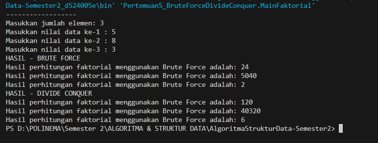

# <p align ="center">  LAPORAN PRAKTIKUM IV </p> 
# <p align ="center">  Brute Force Devide Conquer </p> 
<br><br><br><br>

<p align="center">
    </p>

<br><br><br><br><br>


<p align = "center"> Nama : Rangga Dwi Saputra </p>
<p align = "center"> NIM  : 2341720248 </p>
<p align = "center"> Prodi: D-IV Teknik Informatika</p>
<p align = "center"> Kelas: 1B / 23 </p>

<br><br><br><br><br> 

## Percobaan 1 : Menghitung Nilai Faktorial dengan Algoritma Brute Force dan Divide and Conquer
### 4.1.1 Code: 
```java
package Pertemuan5_BruteForceDivideConquer;
public class Faktorial23 {
    public int nilai;

    public int faktorialBF(int n) {
        int fakto = 1;
        for (int i=1; i < n; i++ ){
            fakto = fakto * i;
        }
        return fakto;
    }

    public int faktorialDC(int n){
        if (n==1){
            return 1;
        } else {
            int fakto = n * faktorialDC(n-1);
            return fakto;
        }
    }
}
```
Class Main: <br>
```java
package Pertemuan5_BruteForceDivideConquer;
import java.util.Scanner;
public class MainFaktorial {
    
    public static void main(String[] args) {
        Scanner sc = new Scanner(System.in);
        System.out.println("------------------");
        System.out.print("Masukkan jumlah elemen: ");
        int iJml = sc.nextInt();
        
        Faktorial23 [] fk = new Faktorial23[10];
        for (int i=0; i < iJml; i++){
            fk[i] = new Faktorial23();
            System.out.print("Masukkan nilai data ke-" +(i+1)+ " : ");
            int iNilai = sc.nextInt();
            fk[i].nilai = iNilai; // ini penting
        }

        System.out.println("HASIL - BRUTE FORCE");
        for (int i=0; i < iJml; i++){
        System.out.println("Hasil perhitungan faktorial menggunakan Brute Force adalah: " + fk[i].faktorialBF(fk[i].nilai));
        }

        System.out.println("HASIL - DIVIDE CONQUER");
        for (int i=0; i < iJml; i++){
        System.out.println("Hasil perhitungan faktorial menggunakan Brute Force adalah: " + fk[i].faktorialDC(fk[i].nilai));
        }
    }    
}
```
### 4.1.2 Hasil Compile

### 4.1.3 Pertanyaan
1.  Pada base line Algoritma Divide Conquer untuk melakukan pencarian nilai faktorial, jelaskan 
perbedaan bagian kode pada penggunaan if dan else! 
2.  Apakah memungkinkan perulangan pada method faktorialBF() dirubah selain menggunakan 
for?Buktikan! 
3.  Jelaskan perbedaan antara fakto *= i; dan int fakto = n * faktorialDC(n-1); !
### 4.1.4 Jawaban
1.   Jika memenuhi kondisi if dimana n == 1 maka nilai yang direturnkan adalah 1. Jika kondisinya n bukan 1 (else) maka nilai yang direturnkan nilai fakto dioperasikan terlebih dahulu menggunakan rumus `fakto = n * faktorialDC(n-1);`, nilai n dikali dengan rekursif fungsi itu sendiri yang nilai n nya dikurangi 1
2.  Tentu saja, bisa menggunakan perulangan while atau do while. Berikut contoh menggunakan while: <br>
    ```java
    public int faktorialBF(int n) {
        int fakto = 1;
        int i=1;
        while (i<n) {
            fakto = fakto * i;
            i++;
        }
        return fakto;
    }
    ```
3.  `fakto *= i;` nilai fakto langsung dikali dengan nilai i. Sedangkan `int fakto = n * faktorialDC(n-1);` nilai fakto yang tersimpan dalam tipe data int dioperasikan terlebih dahulu, nilai n dikali dengan rekursif fungsi itu sendiri yang nilai n nya dikurangi 1
## Percobaan 2 : Menghitung Hasil Pangkat dengan Algoritma Brute Force dan Divide and Conquer
### 4.2.1 Code: 
```java
package Pertemuan5_BruteForceDivideConquer;

public class Pangkat23 {
    public int nilai, pangkat;

    int pangkatBF(int a, int n){
        int hasil=1;
        for (int i=0; i < n ; i++){
            hasil *= a;
        }
        return hasil;
    }

    int pangkatDC(int a, int n){
        if (n==0){
            return 1;
        } else {
            if (n%2==1) {
                return ( pangkatDC(a, (n-1)/2) * pangkatDC(a, (n-1)/2) * a);
            } else {
                return (pangkatDC(a, n/2) * pangkatDC(a, n/2));
            }
        }
    }
}

```
Class Main <br>
```java
package Pertemuan5_BruteForceDivideConquer;
import java.util.Scanner;
public class MainPagkat {
    public static void main(String[] args) {
        Scanner sc = new Scanner(System.in);
        System.out.println("==================");
        System.out.print("Masukkan jumlah elemen yang ingin dihitung :"); 
        int elemen = sc.nextInt();

        Pangkat23 [] png = new Pangkat23[elemen];
        for (int i=0; i < elemen; i++){
            png [i] = new Pangkat23();
            System.out.print("Masukkan nilai yang ingin dipangkatkan: ");
            int nilai = sc.nextInt();
            png[i].nilai = nilai;
            System.out.print("Masukkan nilai pemangkatnya: ");
            int pangkat = sc.nextInt();
            png[i].pangkat = pangkat;
        }

        System.out.println("HASIL PANGKAT - BRUTE FORCE");
        for (int i=0; i < elemen; i++) {
        System.out.println("hasil dari "
            +png[i].nilai+ " pangkat "
            +png[i].pangkat+ " adalah "
            +png[i].pangkatBF(png[i].nilai, png[i].pangkat)
            );
        }
        System.out.println("HASIL - DEVIDE AND CONQUER");
        for (int i=0; i < elemen; i++) {
            System.out.println("hasil dari "
                +png[i].nilai+ " pangkat "
                +png[i].pangkat+ " adalah "
                +png[i].pangkatDC(png[i].nilai, png[i].pangkat)
                );
            }
    } 
}
```
### 4.2.2 Hasil Compile

### 4.2.3 Pertanyaan
1.  Jelaskan mengenai perbedaan 2 method yang dibuat yaitu PangkatBF() dan PangkatDC()! 
2.  Apakah tahap combine sudah termasuk dalam kode tersebut?Tunjukkan! 
3.  Modifikasi kode program tersebut, anggap proses pengisian atribut dilakukan dengan 
konstruktor. 
4.  Tambahkan menu agar salah satu method yang terpilih saja yang akan dijalankan menggunakan switch-case! 
### 4.2.3 Jawab
1.  Metode Brute Force menggunakan pendekatan iteratif dengan melakukan perkalian sebanyak `n` kali, di mana `n` adalah pangkat yang diinginkan.
Pada setiap iterasi, nilai `a` akan dikalikan dengan dirinya sendiri sebanyak `n` kali <br>
Metode Devide and Conquer menggunakan pendekatan rekursif untuk membagi masalah menjadi submasalah yang lebih kecil, membagi pangkat `n` menjadi dua bagian, sehingga kompleksitas waktu dapat berkurang
2.  tahap *combine* tidak diekspresikan secara langsung dalam kode tersebut. Tahap *combine* dalam algoritma Divide and Conquer umumnya mengacu pada penggabungan (combine) hasil dari submasalah yang lebih kecil untuk membentuk solusi dari masalah asli, dalam kode pangkatDC, penggabungan nilai-nilai submasalah yang lebih kecil telah terjadi secara implisit melalui operasi perkalian (*). Saat kita memanggil `pangkatDC(a, n/2)` untuk memperoleh hasil pangkat dari nilai setengah n, kedua hasil tersebut akan digabungkan melalui operasi perkalian pada ekspresi `pangkatDC(a, (n-1)/2) * pangkatDC(a, (n-1)/2) * a` atau `pangkatDC(a, n/2) * pangkatDC(a, n/2)` tergantung pada nilai n (genap atau ganjil).
3.  Ini adalah modifikasi pengisian atribut dengan konstruktor <br>
```java
Pangkat23 [] png = new Pangkat23[elemen];
        for (int i=0; i < elemen; i++){
            // png [i] = new Pangkat23();
            System.out.print("Masukkan nilai yang ingin dipangkatkan: ");
            int nilai = sc.nextInt();
            // png[i].nilai = nilai;
            System.out.print("Masukkan nilai pemangkatnya: ");
            int pangkat = sc.nextInt();
            // png[i].pangkat = pangkat; 
            png[i] = new Pangkat23(nilai, pangkat);
        }
```
di class Pangkat23 ditambahkan konstruktor yang menerima nilai dan pangkat sebagai variabel <br>
```java
 public Pangkat23(int nilai, int pangkat) {
        this.nilai = nilai;
        this.pangkat = pangkat;
    }
```
4.  Berikut modifikasi agar salah satu method yang terpilih saja yang akan dijalankan menggunakan switch-case!  <br>
```java
System.out.println("Methode perhitungan :");
        System.out.println("1.\tBrute Force\n2.\tDevide and Conquer");
        int pilih = sc.nextInt();

        switch (pilih) {
            case 1 :
            System.out.println("HASIL PANGKAT - BRUTE FORCE");
            for (int i=0; i < elemen; i++) {
            System.out.println("hasil dari "
                +png[i].nilai+ " pangkat "
                +png[i].pangkat+ " adalah "
                +png[i].pangkatBF(png[i].nilai, png[i].pangkat)
                );
            }
            break;
            case 2:
            System.out.println("HASIL - DEVIDE AND CONQUER");
            for (int i=0; i < elemen; i++) {
                System.out.println("hasil dari "
                    +png[i].nilai+ " pangkat "
                    +png[i].pangkat+ " adalah "
                    +png[i].pangkatDC(png[i].nilai, png[i].pangkat)
                    );
                }
            break;
            default :
            System.out.println("pilihan invalid");
            break;
            }
```


## Percobaan 3 : Menghitung Hasil Pangkat dengan Algoritma Brute Force dan Divide and Conquer
### 4.3.1 Hasil Compile
```java
=========================
Program Menghitung Keuntungan Total (Satuan Juta. Misal 5.9) : Masukkan jumlah bulan: 5    
=========================
Masukkan keuntungan pada bulan ke-1 = 8.5
Masukkan keuntungan pada bulan ke-2 = 9.54
Masukkan keuntungan pada bulan ke-3 = 7.2
Masukkan keuntungan pada bulan ke-4 = 9.1
Masukkan keuntungan pada bulan ke-5 = 6
=========================
Algoritma Brute Force
Total keuntungan perusahaan selama 5 bulan adalah 40.339999999999996
=========================
Algoritma Devide Conquer
Total keuntungan perusahaan selama 5 bulan adalah 40.339999999999996
PS D:\POLINEMA\Semester 2\ALGORITMA & STRUKTUR DATA\AlgoritmaStrukturData-Semester2>
```
### 4.3.2 Pertanyaan
1.  Mengapa terdapat formulasi return value `return lsum+rsum+arr[mid];`?Jelaskan!
*Jawab* : Formulasi return value return lsum + rsum + arr[mid]; muncul saat ingin menghitung total dari seluruh elemen dalam array yang dipisahkan menjadi dua bagian saat menggunakan algoritma Divide and Conquer
2.  Kenapa dibutuhkan variable `mid` pada method `TotalDC()`?
*Jawab* : untuk menjadi titik yang membagi semua nilai menjadi 2 bagian. dan variabel `mid` menjadi penengah dari nilai yang dikelompokkan di kanan dan dikirinya

## Latihan Praktikum
```java
package Pertemuan5_BruteForceDivideConquer.praktikum;

public class Showroom23 {
    String merk, tipe;
    int tahun, top_A, top_P;

    Showroom23 (String merk, String tipe, int tahun, int top_A, int top_P) {
        this.merk = merk;
        this.tipe = tipe;
        this.tahun = tahun;
        this.top_A = top_A;
        this.top_P = top_P;
    }

    public static void main(String[] args) {
        // instance array of object
        Showroom23 [] data = new Showroom23[8];

        data[0] = new Showroom23("BMW", "M2 Coupe", 2016, 6816, 728);
        data[1] = new Showroom23("FORD", "Fiesta ST", 2014, 3921, 575);
        data[2] = new Showroom23("Nissan", "370Z", 2009, 4360, 657);
        data[3] = new Showroom23("Subaru", "BRZ", 2014, 4058, 609);
        data[4] = new Showroom23("Subaru", "Impreza WRX STI", 2013, 6255, 703);
        data[5] = new Showroom23("Toyota", "AE86 Trueno", 1986, 3700, 553);
        data[6] = new Showroom23("Toyota", "86/GT86", 2014, 4180, 609);
        data[7] = new Showroom23("Volkswagen", "Golf GTI", 2014, 4180, 631);
    
        // Data top_acceleration
        int[] topAcceleration = new int[data.length];
        for (int i = 0; i < topAcceleration.length; i++) {
            topAcceleration[i] = data[i].top_A;
        }

        // Data top_power
        int[] topPower = new int[data.length];
        for (int i = 0; i < topPower.length; i++) {
            topPower[i] = data[i].top_P;
        }

        // Proses output
        System.out.println(
            "Top Acceleration tertinggi (DIVIDE AND CONQUER): " + cariTopAccelerationTertinggi(topAcceleration, 0, topAcceleration.length - 1) + "\n" +
            "Top Acceleration terendah (DIVIDE AND CONQUER): " + cariTopAccelerationTerendah(topAcceleration, 0, topAcceleration.length - 1) + "\n" +
            "Rata-rata top power (BRUTE FORCE) : " + hitungRataRataTopPower(topPower)
        );
    }

    
    static int cariTopAccelerationTertinggi(int topAccelera[], int l, int r) {
        if (l == r) {
            return topAccelera[l];
        } else {
            int mid = (l + r) / 2;
            int lTop = cariTopAccelerationTertinggi(topAccelera, l, mid);
            int rTop = cariTopAccelerationTertinggi(topAccelera, mid + 1, r);
            if (lTop > rTop) {
                return lTop;
            } else {
                return rTop;
            }
        }
    }

    static int cariTopAccelerationTerendah(int topAccelera[], int l, int r) {
        if (l == r) {
            return topAccelera[l];
        } else {
            int mid = (l + r) / 2;
            int lTop = cariTopAccelerationTerendah(topAccelera, l, mid);
            int rTop = cariTopAccelerationTerendah(topAccelera, mid + 1, r);
            if (lTop < rTop) {
                return lTop;
            } else {
                return  rTop;
            }
        }
    }

    static double hitungRataRataTopPower(int topPower[]) {
        int totalPower = 0;
        for (int i : topPower) {
            totalPower += i;
        }

        return totalPower / topPower.length;
    }
}
```    
### Hasil Compile
```java
PS D:\POLINEMA\Semester 2\ALGORITMA & STRUKTUR DATA\AlgoritmaStrukturData-Semester2>  & 'C:\Program Files\Java\jdk-17\bin\java.exe' '-XX:+ShowCodeDetailsInExceptionMessages' '-cp' 'C:\Users\Rangga Dwi Saputra\AppData\Roaming\Code\User\workspaceStorage\5af40744b181229fd2904db21f5f351e\redhat.java\jdt_ws\AlgoritmaStrukturData-Semester2_d524005e\bin' 'Pertemuan5_BruteForceDivideConquer.praktikum.Showroom23'
Top Acceleration tertinggi (DIVIDE AND CONQUER): 6816
Top Acceleration terendah (DIVIDE AND CONQUER): 3700
Rata-rata top power (BRUTE FORCE) : 633.0
```
