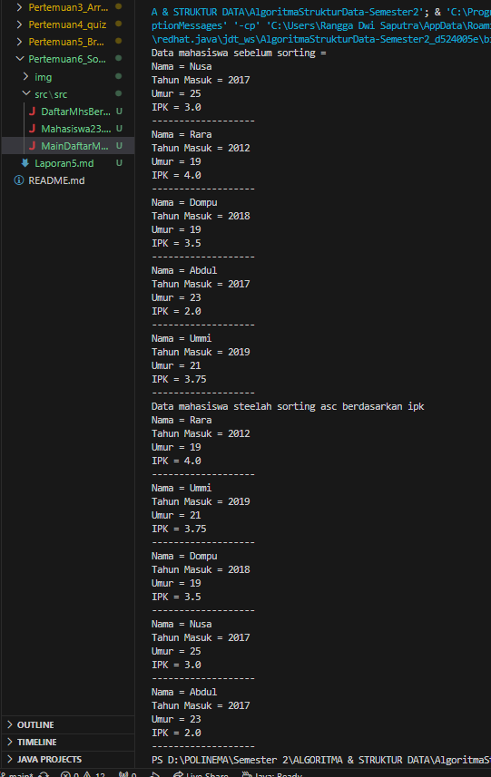
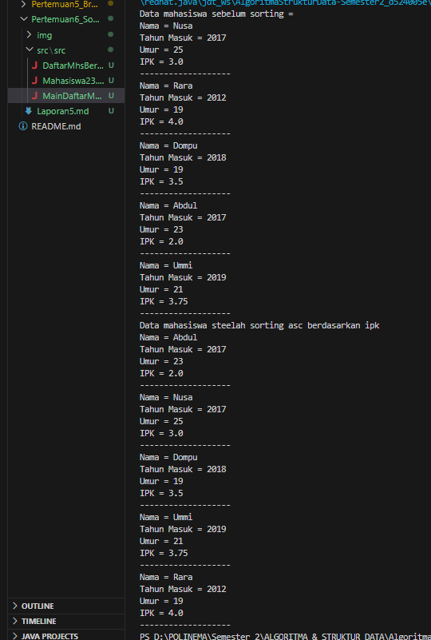

# <p align ="center">  LAPORAN PRAKTIKUM V </p> 
# <p align ="center">  Sorting </p> 
<br><br><br><br>

<p align="center">
    </p>

<br><br><br><br><br>


<p align = "center"> Nama : Rangga Dwi Saputra </p>
<p align = "center"> NIM  : 2341720248 </p>
<p align = "center"> Prodi: D-IV Teknik Informatika</p>
<p align = "center"> Kelas: 1B / 23 </p>

<br><br><br><br><br>

### Percobaan 1 : Mengurutkan Data Mahasiswa Berdasarkan IPK Menggunakan Bubble Sort
Verifikasi Output hasil percobaan <br>


**Pertanyaan**
1.  Terdapat di method apakah proses bubble sort?
2.  Di dalam method bubbleSort(), untuk apa proses berikut ini?
    ```java
    if (listMhs[j].ipk > listMhs[j-1].ipk) {
                Mahasiswa23 tmp = listMhs[j];
                listMhs[j] = listMhs[j-1];
                listMhs[j-1] = tmp;
            }
    ```
3.  Perhatikan perulangan di dalam bubbleSort() di bawah ini:
    ```java
    for (int i=0; i < listMhs.length ; i++) {
        for (int j=1; j < listMhs.length ; j++) {
    ```
    a. Apakah perbedaan antara kegunaan perulangan i dan perulangan j? <br>
    b. Mengapa syarat dari perulangan i adalah i<listMhs.length-1 ? <br>
    c. Mengapa syarat dari perulangan j adalah j<listMhs.length-i ? <br>
    d. Jika banyak data di dalam listMhs adalah 50, maka berapakali perulangan i akan 
berlangsung? Dan ada berapa Tahap bubble sort yang ditempuh?
### Percobaan 2 : Mengurutkan Data Mahasiswa Berdasarkan IPK Menggunakan Selection Sort
Verifikasi Output hasil percobaan <br>


**Pertanyaan**
Didalam methode selection sort, terdapat baris program seperti dibawah ini
```java
 int idxMin = i; 

       for (int j=i+1; j < listMhs.length ; j++) {
        if (listMhs[j].ipk > listMhs[idxMin].ipk) {
            idxMin = j;
         }
       }
```
Untuk apakah proses tersebut, jelaskan!
### Percobaan 3 : Mengurutkan Data Mahasiswa Berdasarkan IPK Menggunakan Insertion Sort
Verifikasi Output hasil percobaan <br>


**Pertanyaan**
Ubahlah fungsi pada InsertionSort sehingga fungsi ini dapat melaksanakan proses sort dengan cara descending
