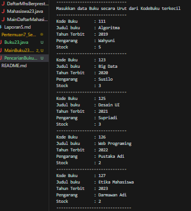
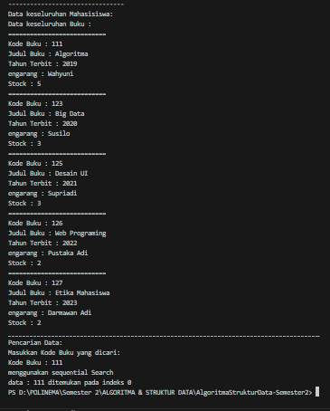
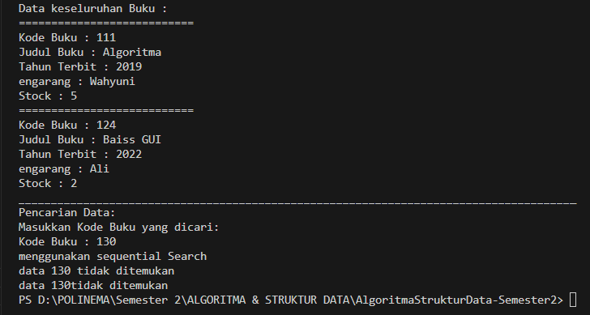
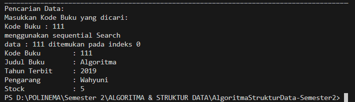
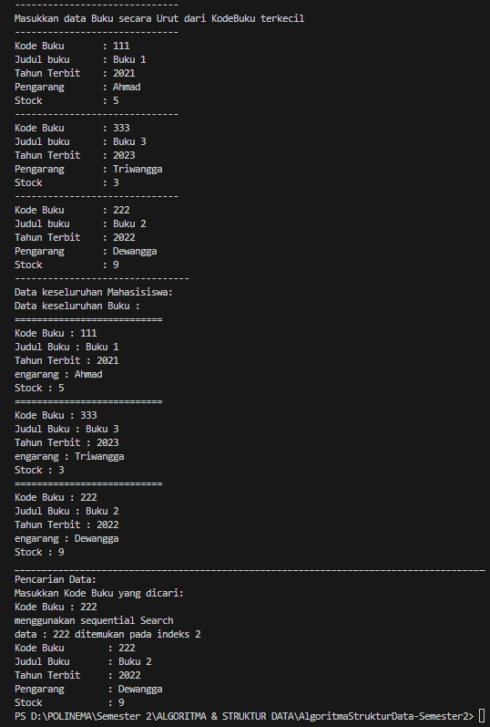
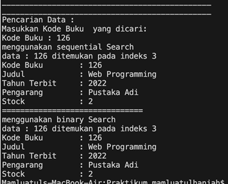
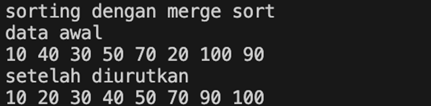

# <p align ="center">  LAPORAN PRAKTIKUM VI </p> 
# <p align ="center">  Searching </p> 
<br><br><br><br>

<p align="center">
    </p>

<br><br><br><br><br>


<p align = "center"> Nama : Rangga Dwi Saputra </p>
<p align = "center"> NIM  : 2341720248 </p>
<p align = "center"> Prodi: D-IV Teknik Informatika</p>
<p align = "center"> Kelas: 1B / 23 </p>

<br><br><br><br><br>

### Percobaan 1 : Searching / Pencarian Menggunakan Agoritma Sequential Search 
Verifikasi penginputan data <br>

Verifikasi output dan hasil pencarian <br>

Hasil output jika pencarian gagal<br>

Hasil output jika pencarian berhasil


**Pertanyaan**
1.  Jelaskan fungsi break yang ada pada method FindSeqSearch! <br>
    *Jawab* : Menghentikan program apabila data yang dicari sudah ditemukan
2.  Jika Data Kode Buku yang dimasukkan tidak terurut dari kecil ke besar. Apakah program masih dapat berjalan? Apakah hasil yang dikeluarkan benar? Tunjukkan hasil screenshoot untuk bukti dengan kode Buku yang acak. Jelaskan Mengapa hal tersebut bisa terjadi? <br>
    *Jawab* : Bisa, karena dalam sequential search pengecekan nilai berdasarkan indeksnya, bukan urutan nilainya
    
3.  Buat method baru dengan nama FindBuku menggunakan konsep sequential search dengan tipe 
method dari FindBuku adalah BukuNoAbsen. <br>
    *Jawab*
    ```java
    public Buku23 FindBuku (int cari) {
    int posisi=0;
    for (int j = 0; j < listBk.length; j++) {
        if (listBk[j].kodeBuku==cari) {
            posisi = j; // perbaikan bug
            break;
        // updatenya
        } else {
            posisi = -1;
        }
    }
    return posisi;
    }
    ```

    ```java
    Buku23 dataBuku = data.FindBuku(cari);
    dataBuku.tampilDataBuku();
    ```

### Percobaan 2 : Searching / Pencarian Menggunakan Binary Search 
Verifikasi Hasil <br>

1. Tunjukkan pada kode program yang mana proses divide dijalankan! <br>
    *Jawab* : Kode program divide adalah `mid = (right + left) / 2;`. array dibagi menjadi dua bagian yang lebih kecil dengan menentukan nilai tengah (mid). Ini membagi rentang pencarian menjadi dua bagian yang lebih kecil. 
        
2. Tunjukkan pada kode program yang mana proses conquer dijalankan! <br>
    *Jawab* : Kode Program conquer, mencari elemen yang dicari di subarray yang lebih kecil (bagian kiri atau kanan) berdasarkan nilai tengah (mid). Jika elemen yang dicari ditemukan, fungsi mengembalikan indeksnya. Jika tidak, fungsi melakukan pencarian rekursif pada subarray yang lebih kecil yang kemudian dibagi menjadi dua bagian lagi, dan demikian seterusnya hingga elemen ditemukan atau rentang pencarian menjadi kosong (right < left) <br>
    ```java
    if (cari == listBk[mid].kodeBuku) {
    return (mid);
    } else if (listBk[mid].kodeBuku > cari) {
        return FindBinarySearch(cari, left, mid - 1);
    } else {
        return FindBinarySearch(cari, mid + 1, right);
    }
    ```
4. Jika data Kode Buku yang dimasukkan tidak urut. Apakah program masih dapat berjalan? Mengapa 
demikian! Tunjukkan hasil screenshoot untuk bukti dengan kode Buku yang acak. Jelaskan 
Mengapa hal tersebut bisa terjadi? <br>
*Jawab* : Bisa, karena data akan diurutkan lalu dibagi untuk mencari nilai tengahnya, kemudian mencari nilai yang dicari. Berikut buktinya
```java
------------------------------
Masukkan data Buku secara Urut dari KodeBuku terkecil
------------------------------
Kode Buku       : 123
Judul buku      : Web Programing
Tahun Terbit    : 2023
Pengarang       : Saputra      
Stock           : 5
------------------------------
Kode Buku       : 121
Judul buku      : Design
Tahun Terbit    : 2021
Pengarang       : Rangga
Stock           : 3
------------------------------
Kode Buku       : 122
Judul buku      : Marketing
Tahun Terbit    : 2022
Pengarang       : Dwi
Stock           : 2
--------------------------------
Data keseluruhan Mahasisiswa: 
Data keseluruhan Buku : 
===========================
Kode Buku : 123
Judul Buku : Web Programing
Tahun Terbit : 2023
engarang : Saputra
Stock : 5
===========================
Kode Buku : 121
Judul Buku : Design
Tahun Terbit : 2021
engarang : Rangga
Stock : 3
===========================
Kode Buku : 122
Judul Buku : Marketing
Tahun Terbit : 2022
engarang : Dwi
Stock : 2
______________________________________________________________________________________
Pencarian Data:
Masukkan Kode Buku yang dicari:
Kode Buku : 122
menggunakan sequential Search
data : 122 ditemukan pada indeks 2
Kode Buku        : 122
Judul Buku       : Marketing
Tahun Terbit     : 2022
Pengarang        : Dwi
Stock            : 2

=============================
Menggunakan Binary Search
data : 122 ditemukan pada indeks 2
Kode Buku        : 122
Judul Buku       : Marketing
Tahun Terbit     : 2022
Pengarang        : Dwi
Stock            : 2
```

3. Jika Kode Buku yang dimasukkan dari Kode Buku terbesar ke terkecil (missal : 20215, 20214, 
20212, 20211, 20210) dan elemen yang dicari adalah 20210. Bagaimana hasil dari binary search? 
Apakah sesuai? Jika tidak sesuai maka ubahlah kode program binary seach agar hasilnya sesuai! 
```java
Pencarian Data:
Masukkan Kode Buku yang dicari:
Kode Buku : 20210
menggunakan sequential Search
data : 20210 ditemukan pada indeks 4
Kode Buku        : 20210
Judul Buku       : E
Tahun Terbit     : 2010
Pengarang        : Edi
Stock            : 7

=============================
Menggunakan Binary Search
data 20210 tidak ditemukan
data 20210tidak ditemukan
```

### Percobaan 3 : Percobaan Pengayaan Devide and Conquer
Verifikasi Hasil Percobaan <br>


### Latihan Praktikum
