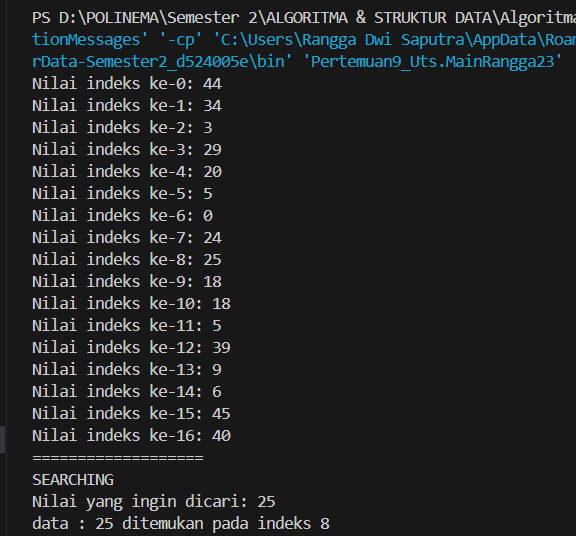
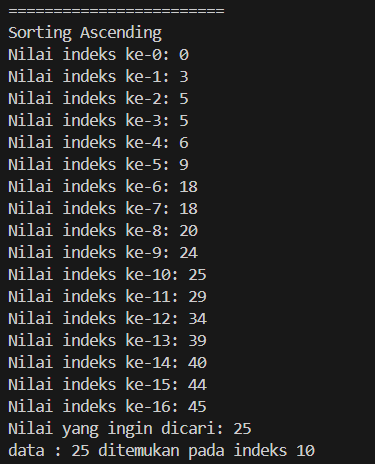
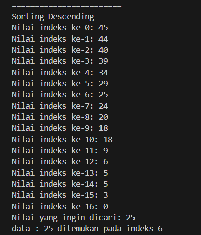
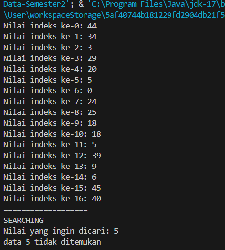
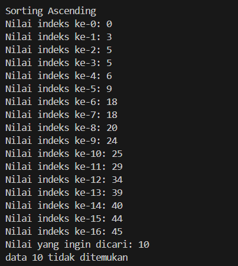
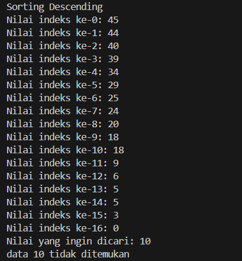

### Nilai yang dapat ditemukan (ditunjukkan pada lokasi index sebelum pengurutan)

### Nilai yang dapat ditemukan (ditunjukkan pada lokasi index setelah pengurutan secara ascending)

### Nilai yang dapat ditemukan (ditunjukkan pada lokasi index setelah pengurutan secara descending)

### Nilai yang tidak dapat ditemukan

